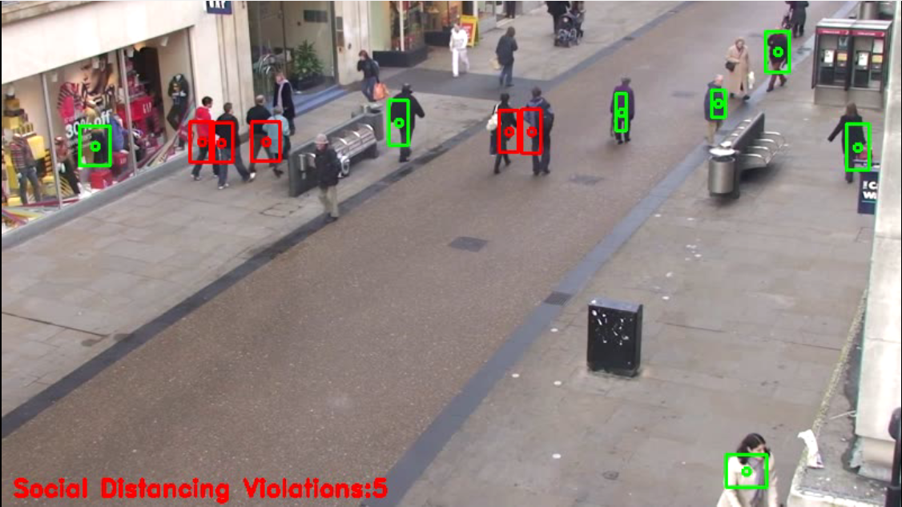
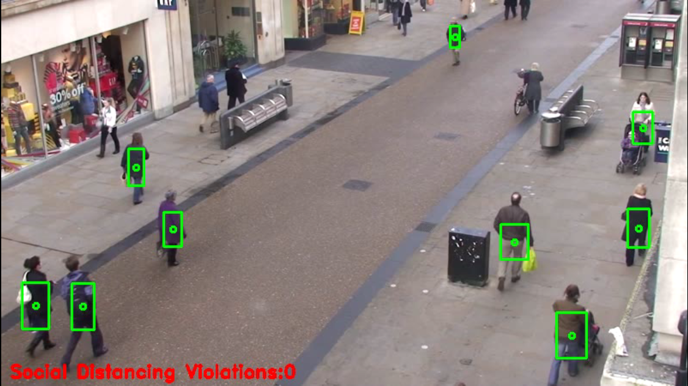
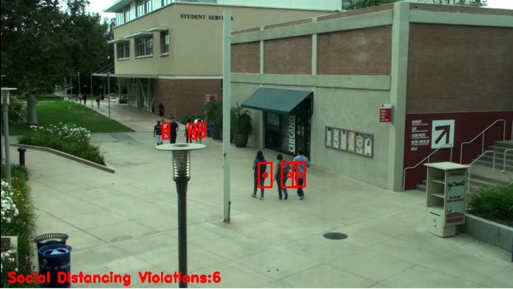
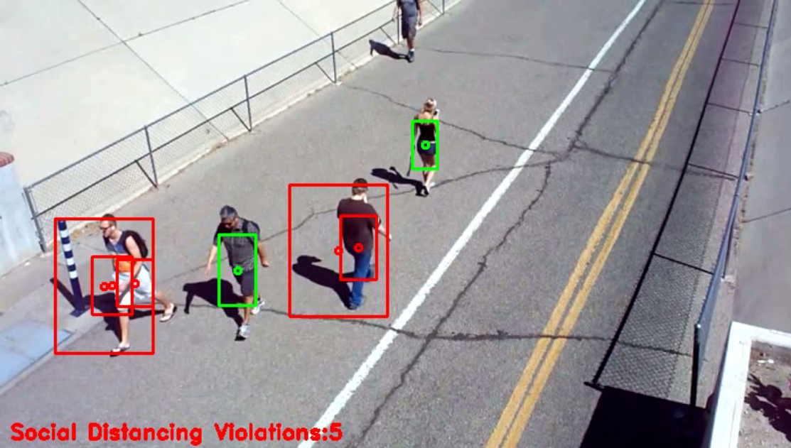
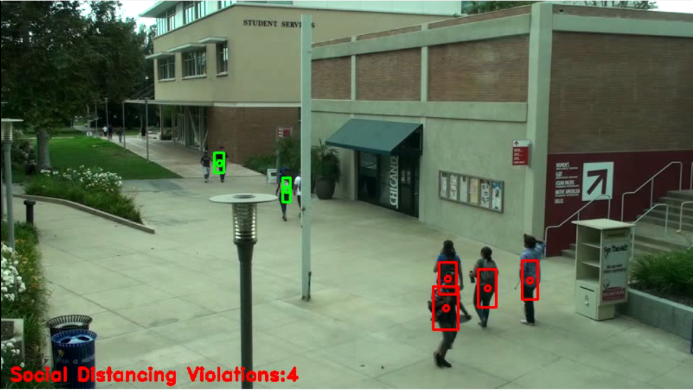

# Social-Distancing-Detection
This repo contains code for a covid19 utility- social distancing detection using Tiny Yolo Model to be able to run on smaller GPU systems too.

This is a Computer Vision Project which served as one part of my Final Year Project- <strong> Implementation of Face Detection and Object Tracking Techniques to Develop Covid19 Utilities for Face Mask Detection and Social Distancing Violations Detection </strong>

The project features use of Transfer Learning to save time.

# Model Download Files
Model Weight Files : [Google Drive](https://drive.google.com/drive/folders/1NUrdd8fw38jFlJMTP8ysmiyzfbbrHi82?usp=sharing)

# Dataset Used
We used a pretrained YOLOv3 Model on COCO Dataset for this project.

# Methodology Used

* To explain the working of this system, we start by taking each frame from a video feed and decrease it's size to 1/4 of original frame size for faster processing. 

* Then the image is passed through a YOLOv3 model (tiny-yolo for faster execution but poorer results) to get bounding boxes of each person in the video.

* Once we get the bounding boxes, we calculate the centroids of each box and then use an itertools method to get all combinations of the centroids.

* Distance between each combination of centroid is calculated and checked across a threshold value.

* If distance is less than threshold value then  those are marked as violations else safe.

For better results, more preprocessing can be done for each image and a better/faster object detection model can be used.

## Social Distancing Detection Use Case:

## Social Distancing Detection Architecture:

## Social Distancing Detection Flow Chart:

## Social Distancing Detection Module Heirarchy Diagram:

# Model Results 
## YOLO v3 Table of Results:

# Outputs:
## Regular Feed Output: 

## No Violations Feed Output: 

## All Violations Feed Output: 

## Failures:
### Object Detection Model Failure:

### half Off Prediction:

# To Do:

1. Add Pipelines
2. Model Retraining Support
3. UI Interface
4. Accuracy/Precision/Recall Improvement
5. Deployment
6. Requirements and project documentation
7. Realtime Detection Performance
8. Add Bird Eye View and transforme coordinates/centroids accordingly for better results.
9. Self configuration of threshold value depending on camera location.
10. Non GPU device support.

# Inspiration:
In this time of pandemic struck world, I had to do my part as an AI/ML engineer to develop something which can actually be used. Though this project is far from over, but it's the start of something. Later I was able to mentor a team in a hackathon on a similar problem statement as my final year project and this starting guide/code helped them a lot, so it's probably a win - win situation.

# Acknowledgements:
A special thanks to [Adrian Rosebrock](https://github.com/jrosebr1) and his blog at [PyImageSearch](https://www.pyimagesearch.com/) for helping out with this project.

Also thanks to many other github contributors who've worked on similar projects. Thanks for your repos and guidance.

Another shoutout to [Landing AI](https://landing.ai/landing-ai-creates-an-ai-tool-to-help-customers-monitor-social-distancing-in-the-workplace/)

